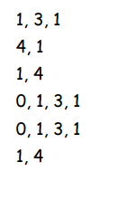
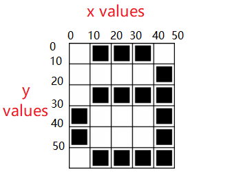

# Lets get Drawing

- We will use the following built-in functions to draw simple shapes:
    - Pen or Pencil
    - Graph Paper

We're going to start by drawing an **a**

# Whats a pixel?
 
 A pixel is the smallest unit of a digital image or graphic that can be displayed and represented on a digital display

 Computer screens are divided up into a grid of small dots called pixels (**pic**ture **el**ements)
 In a black and white picture, each pixel is either black or white.

 

The picture above shows us how a picture can be represented by numbers. The first line
consists of one white pixel, then three black, then one white. Thus the first line is
represented as 1, 3, 1.
The first number always relates to the number of white pixels. If the first pixel is black
the line will begin with a zero. 

# Get your pen and paper

Using your pen and graph paper, try to recreate the image using the instructions

 

Once you have it completed, add in the grid numbers.  Each box is 10*10, and the grid starts at 0,0 in the top left hand corner

 

**Now lets move to processing and code it.**

