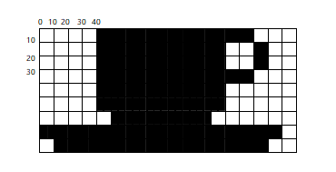

# Lets try another one

How about a cup of coffee?

 

- Using your pen and paper follow the instructions to draw the cup

Once you have it completed, add in the grid numbers.  Each box is 10*10, and the grid starts at 0,0 in the top left hand corner

 

Now, lets try to code it, remember you are just writing the code for the black squares?

**Try to write the code yourself, before copying in the code below**

~~~  

    size(200, 200);
    fill(0);
    //line 1
    rect(40,0,10,10);
    rect(50,0,10,10);
    rect(60,0,10,10);
    rect(70,0,10,10);
    rect(80,0,10,10);
    rect(90,0,10,10);
    rect(100,0,10,10);
    rect(110,0,10,10);
    rect(120,0,10,10);
    rect(130,0,10,10);
    rect(140,0,10,10);
    //line 2
    rect(40,10,10,10);
    rect(50,10,10,10);
    rect(60,10,10,10);
    rect(70,10,10,10);
    rect(80,10,10,10);
    rect(90,10,10,10);
    rect(100,10,10,10);
    rect(110,10,10,10);
    rect(120,10,10,10);

    rect(150,10,10,10);
    //line 3
    rect(40,20,10,10);
    rect(50,20,10,10);
    rect(60,20,10,10);
    rect(70,20,10,10);
    rect(80,20,10,10);
    rect(90,20,10,10);
    rect(100,20,10,10);
    rect(110,20,10,10);
    rect(120,20,10,10);

    rect(150,20,10,10);
    //line 4
    rect(40,30,10,10);
    rect(50,30,10,10);
    rect(60,30,10,10);
    rect(70,30,10,10);
    rect(80,30,10,10);
    rect(90,30,10,10);
    rect(100,30,10,10);
    rect(110,30,10,10);
    rect(120,30,10,10);
    rect(130,30,10,10);
    rect(140,30,10,10);
    //line 5
    rect(40,40,10,10);
    rect(50,40,10,10);
    rect(60,40,10,10);
    rect(70,40,10,10);
    rect(80,40,10,10);
    rect(90,40,10,10);
    rect(100,40,10,10);
    rect(110,40,10,10);
    rect(120,40,10,10);
    //line 6
    rect(50,50,10,10);
    rect(60,50,10,10);
    rect(70,50,10,10);
    rect(80,50,10,10);
    rect(90,50,10,10);
    rect(100,50,10,10);
    rect(110,50,10,10);

    //line 7
    rect(0,60,10,10);
    rect(10,60,10,10);
    rect(20,60,10,10);
    rect(30,60,10,10);
    rect(40,60,10,10);
    rect(50,60,10,10);
    rect(60,60,10,10);
    rect(70,60,10,10);
    rect(80,60,10,10);
    rect(90,60,10,10);
    rect(100,60,10,10);
    rect(110,60,10,10);
    rect(120,60,10,10);
    rect(130,60,10,10);
    rect(140,60,10,10);
    rect(150,60,10,10);
    rect(160,60,10,10);

    //line 8

    rect(10,70,10,10);
    rect(20,70,10,10);
    rect(30,70,10,10);
    rect(40,70,10,10);
    rect(50,70,10,10);
    rect(60,70,10,10);
    rect(70,70,10,10);
    rect(80,70,10,10);
    rect(90,70,10,10);
    rect(100,70,10,10);
    rect(110,70,10,10);
    rect(120,70,10,10);
    rect(130,70,10,10);
    rect(140,70,10,10);
    rect(150,70,10,10);
~~~  