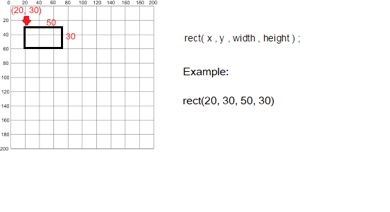

# Simple Shapes

- We will use the following built-in functions to draw simple shapes:
    - rect()

## Drawing Rectangles

-Copy the following code into your canvas

~~~   
    rect(x, y, w, h)
        x = x-coordinate of the upper left corner of the rectangle
        y = y-coordinate of the upper left corner of the rectangle
        w = width of the rectangle
        h = height of the rectangle

        
~~~

- Note that, in computing, the coordinates start in the top left hand corner i.e. (0,0) is in the top left of the screen.  In the following picture, you can see the coordinates of the rectangle (20,30) along with its width (50) and height (30). 

- Enter the following code in your sketchbook:

~~~java
    rect(20,30,50,30);
~~~

- Run the code, by clicking on the **play** button (highlighted in red in the screen shot below):

- The following window should appear with a rectangle that:
    - starts at the (x,y) coordinates (20,30) [measured in pixels]
    - has a width of 50 pixels
    - has a height of 30 pixels

## Drawing Squares

- Using the rect() function, you can draw squares. Just set the width and height to the same number of pixels.

- Below the code you wrote previously, try drawing a square that has starts at the (x,y) coordinates of (40,5) and has a length of 20.  

- Run the code.  Did a square appear?

